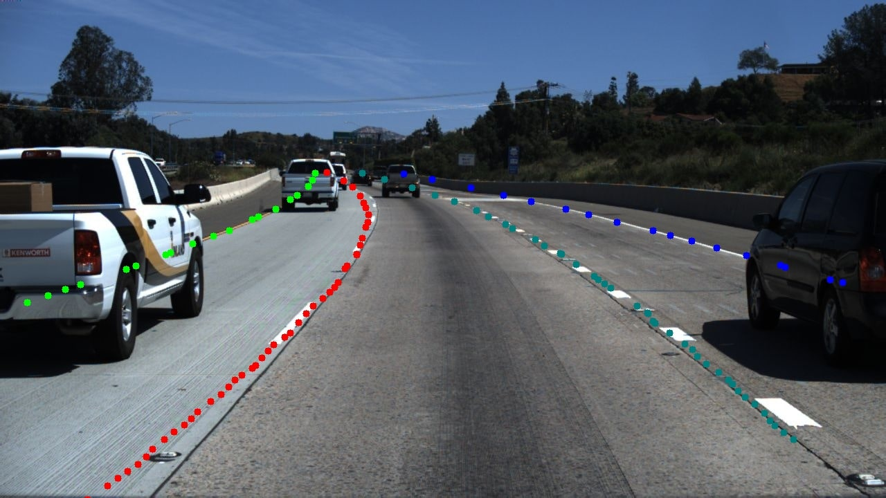
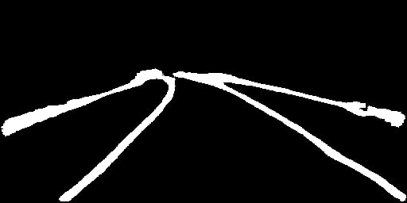
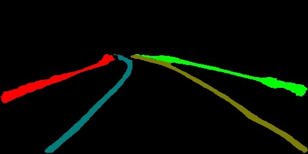

# LaneNet 模型训练教程

* 本教程旨在介绍如何通过使用PaddleSeg进行车道线检测

* 在阅读本教程前，请确保您已经了解过PaddleSeg的[快速入门](../../README.md#快速入门)和[基础功能](../../README.md#基础功能)等章节，以便对PaddleSeg有一定的了解

## 环境依赖

* PaddlePaddle >= 2.1.2 或develop版本
* Python 3.6+


## 一. 准备待训练数据

我们提前准备好了一份处理好的数据集，通过以下代码进行下载，该数据集由图森车道线检测数据集转换而来。

```shell
python data/download_tusimple.py
```
你也可以在这个[页面](https://github.com/TuSimple/tusimple-benchmark/issues/3)下载原始数据集。通过以下代码执行生成。

```shell
python tools/generate_tusimple_dataset.py --src_dir path/to/your/unzipped/file

```

数据目录结构
```
LaneNet
|-- data
    |-- tusimple_lane_detection
        |-- training
            |-- gt_binary_image
            |-- gt_image
            |-- gt_instance_image
            |-- train_part.txt
            |-- val_part.txt
```

## 二. 准备配置

接着我们需要确定相关配置，从本教程的角度，配置分为三部分：

* 数据集
  * 数据集类型
  * 数据集根目录
  * 数据增强
* 损失函数
  * 损失函数类型
  * 损失函数系数
* 其他
  * 学习率
  * Batch大小
  * ...

数据集，包括训练数据集和验证数据集，数据集的配置和数据路径有关，在本教程中，数据存放在`dataset/tusimple_lane_detection`中

其他配置则根据数据集和机器环境的情况进行调节，最终我们保存一个如下内容的yaml配置文件，存放路径为**configs/lanenet.yaml**

```yaml
batch_size: 16
iters: 20000

# 训练数据集配置
train_dataset:
  type: LaneSeg
  dataset_root: ./data/tusimple_lane_detection/
  transforms:
    - type: Resize
      target_size: [544, 288]
    - type: RandomDistort
      brightness_range: 0.25
      brightness_prob: 1
      contrast_range: 0.25
      contrast_prob: 1
      saturation_range: 0.25
      saturation_prob: 1
      hue_range: 63
      hue_prob: 1
    - type: RandomHorizontalFlip
    - type: RandomPaddingCrop
      crop_size: [512, 256]
    - type: Normalize


  mode: train

# 验证数据集配置
val_dataset:
  type: LaneSeg
  dataset_root: ./data/tusimple_lane_detection/
  transforms:
    - type: Resize
      target_size: [512, 256]
    - type: Normalize
  mode: val

optimizer:
  type: sgd
  momentum: 0.9
  weight_decay: 4.0e-5

lr_scheduler:
  type: PolynomialDecay
  learning_rate: 0.01
  end_lr: 0
  power: 0.9

# 损失函数配置
loss:
  types:
    - type: LaneCrossEntropyLoss
    - type: DiscriminativeLoss
  coef: [1, 1]

# 模型配置
model:
  type: Lanenet
  pretrained: Null
```


## 三. 开始训练

使用下述命令启动训练

```shell
export CUDA_VISIBLE_DEVICES=0 # 设置1张可用的卡

**windows下请执行以下命令**
**set CUDA_VISIBLE_DEVICES=0**
python train.py \
       --config configs/lanenet.yml \
       --do_eval \
       --use_vdl \
       --save_interval 500 \
       --save_dir output

```

## 四. 进行评估

模型训练完成，使用下述命令启动评估

```shell
python val.py \
       --config configs/lanenet.yml \
       --model_path output/iter_20000/model.pdparams

```

## 五. 可视化
需要先下载一个车前视角和鸟瞰图视角转换所需文件，点击[链接](https://paddleseg.bj.bcebos.com/resources/tusimple_ipm_remap.tar)，下载后放在```./utils```下。

```shell
python predict.py \
       --config configs/lanenet.yml \
       --model_path output/iter_20000/model.pdparams \
       --image_path data/test_images/0.jpg \
       --save_dir output/result

```

可视化结果示例：

  预测结果：<br/>
  <br/>
  分割结果：<br/>
  <br/>
  车道线实例预测结果：<br/>
  
